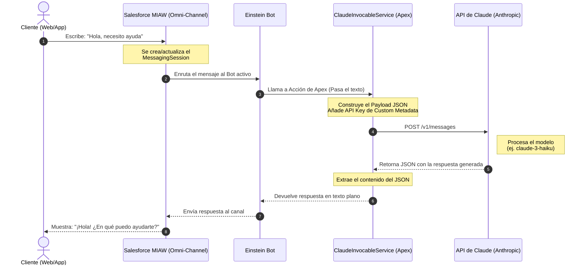

# Arquitectura: Integración de Claude con MIAW (Salesforce)

Este documento describe la arquitectura y el flujo de datos para integrar un agente de Inteligencia Artificial impulsado por **Claude (Anthropic)** directamente en el canal nativo de mensajería de Salesforce conocido como **MIAW** (Messaging for In-App and Web).

## 1. Visión General
El objetivo es permitir que un cliente (usuario final) pueda conversar en tiempo real desde una aplicación móvil o sitio web con un agente de IA, asegurando que toda la transcripción, analítica y el contexto se guarden de forma nativa en Salesforce utilizando el modelo de datos de MIAW (`MessagingSession`, `MessagingEndUser`).

Para lograrlo sin construir interfaces web (LWC) complejas e inestables desde cero, la solución se basa en **Einstein Bots**. El Einstein Bot actúa como "orquestador" del chat de MIAW y delega la toma de decisiones e inteligencia al modelo de lenguaje (LLM) de Anthropic a través de código Apex.

## 2. Diagrama de Secuencia (Flujo de Datos)

A continuación, se muestra el diagrama de cómo viaja un mensaje desde que el usuario lo escribe hasta que la IA responde:

## 3. Componentes de la Arquitectura

### A. Frontend (Canal Nativo)
- **Messaging for In-App and Web (MIAW):** El widget oficial de Salesforce que se incrusta en las páginas web o SDKs móviles del cliente.
- **Omni-Channel:** El motor de enrutamiento que asigna la sesión de chat a un Bot.

### B. Middleware (Orquestador)
- **Einstein Bot:** Un bot configurado en Salesforce que recibe la sesión y se mantiene en un estado de "escucha". Cada vez que recibe una entrada de texto, invoca a Apex.

### C. Backend (Lógica de Integración)
- **ClaudeInvocableService.cls:** Una clase de Apex con el decorador `@InvocableMethod`. Este decorador permite que el Einstein Bot llame a esta clase sin necesidad de escribir código adicional.
- **Remote Site Setting / Named Credential:** Configuración de seguridad en Salesforce que autoriza la salida de peticiones HTTP hacia el dominio `api.anthropic.com`.
- **Custom Metadata Type:** Un objeto personalizado de metadatos utilizado para almacenar de forma encriptada y segura la `API Key` de Anthropic, evitando tener llaves quemadas (hardcoded) en el código fuente.

## 4. Beneficios del Modelo MIAW
* **Historial Completo:** Al terminar el chat, Salesforce guarda de forma permanente la transcripción en el objeto `MessagingSession`, facilitando el monitoreo de calidad.
* **Escalamiento a Humano:** Dado que el Einstein Bot es el intermediario, se puede programar una regla (intent) para que si el cliente solicita "hablar con un humano", el Bot transfiera la sesión de MIAW directamente a un agente de Service Cloud a través de Omni-Channel.
* **Mantenimiento Cero de UI:** No se requiere desarrollar ni dar mantenimiento a componentes Lightning (LWC) para el frontend del chat; Salesforce se encarga de las actualizaciones del widget.
